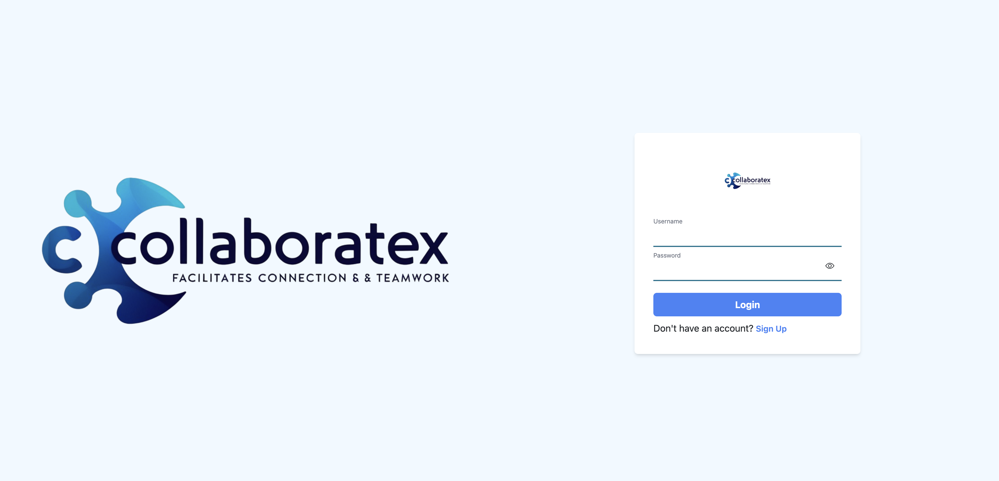
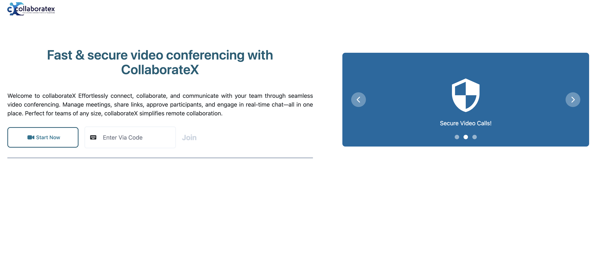
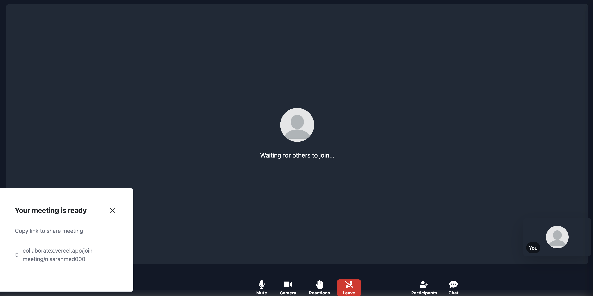

# 🚀 CollaborateX - Real-Time Video Conferencing & Team Collaboration Platform

[](https://opensource.org/licenses/MIT)
[](https://react.dev/)
[](https://nodejs.org/)
[](https://webrtc.org/)
[](https://socket.io/)
[](https://www.mongodb.com/)

**CollaborateX** is a feature-rich, full-stack real-time video conferencing and team collaboration platform. Powered by WebRTC and Socket.io, CollaborateX delivers high-quality peer-to-peer video calling, low-latency live chat, participant management, and seamless media sharing.

---

## 📸 Screenshots Showcase

<div align="center">
  <h3>🏠 Dashboard & Meeting Lobby</h3>
  
  <br/><br/>
  
  <h3>🎥 Real-time Video Call & In-Meeting Chat</h3>
  
  <br/><br/>
  
  <h3>👤 User Profile & Media Management</h3>
  
</div>

---

## ✨ Key Features

- 📹 **Peer-to-Peer Video Conferencing**: Real-time high-definition video and audio streaming powered by **WebRTC** (`simple-peer`) and **Socket.io** signaling.
- 💬 **In-Meeting Live Chat**: Integrated text chat during video calls allowing participants to communicate via instant messages.
- 👥 **Participant Management**: Interactive side drawer to view online participants, active streams, and connection statuses.
- 🔐 **User Authentication**: Secure signup and login workflows with hashed credentials (`bcryptjs`) and session handling.
- 🖼️ **Cloud Media Storage**: Profile picture upload and media handling seamlessly integrated with **Cloudinary**.
- 🔄 **Quick Join & Rejoin**: Create or join meeting rooms effortlessly using unique Room IDs, with quick rejoin capability for dropped connections.
- 📧 **Automated Email Notifications**: Email integration via **Nodemailer** for user invites and notifications.
- 🎨 **Modern Responsive UI**: Built with **React 18**, **Tailwind CSS**, **Flowbite**, and **Styled Components** for an elegant, responsive design across all devices.

---

## 🛠️ Tech Stack

### **Frontend**
- **Framework**: React 18 (Vite)
- **State Management**: Redux Toolkit & React-Redux
- **Real-Time & WebRTC**: `socket.io-client`, `simple-peer`
- **Styling & UI**: Tailwind CSS, Flowbite React, Styled Components, React Icons
- **Media Player & Uploads**: React Player, Cloudinary React SDK

### **Backend**
- **Runtime**: Node.js & Express.js
- **Database**: MongoDB with Mongoose ORM
- **Sockets**: Socket.io for signaling & instant messaging
- **Media & File Handling**: Cloudinary SDK, Multer
- **Email Service**: Nodemailer
- **Authentication**: Bcryptjs

---

## 📁 Repository Structure

```text
collaborateX/
├── backend/                # Express & Socket.io server
│   ├── connection/         # MongoDB database connection setup
│   ├── controllers/        # Request handlers & logic
│   ├── models/             # Mongoose schemas (User, Post, etc.)
│   ├── routes/             # REST API Endpoints (/api/auth, /api/req, etc.)
│   ├── sockets/            # Socket.io connection & WebRTC signaling handlers
│   ├── app.js              # Server entry point
│   └── package.json
├── frontend/               # React + Vite client application
│   ├── src/
│   │   ├── components/     # Reusable UI components (VideoGrid, ChatBox, Navbar, etc.)
│   │   ├── pages/          # Application views (Homepage, VideoCallScreen, Profile, etc.)
│   │   ├── store/          # Redux Toolkit slices
│   │   └── App.jsx         # App router & layout setup
│   └── package.json
├── screenshots/            # Showcase images for documentation
├── package.json            # Root scripts for running client & server concurrently
└── Readme.md               # Project documentation
```

---

## 🚀 Getting Started

### Prerequisites

Ensure you have the following installed on your machine:
- [Node.js](https://nodejs.org/) (v16+ recommended)
- [npm](https://www.npmjs.com/)
- [MongoDB](https://www.mongodb.com/) instance (local or MongoDB Atlas)
- Cloudinary Account (for media uploads)

---

### Environment Setup

Create a `.env` file in the `backend/` directory with the following variables:

```env
PORT=3000
MONGODB_URI=your_mongodb_connection_string
EMAIL_USER=your_email@gmail.com
EMAIL_PASS=your_email_app_password
CLOUDNARY_CLOUD_NAME=your_cloudinary_cloud_name
CLOUDNARY_API_KEY=your_cloudinary_api_key
CLOUDNARY_SECRET_KEY=your_cloudinary_api_secret
```

---

### 📥 Installation & Running

1. **Clone the Repository**
   ```bash
   git clone https://github.com/your-username/collaborateX.git
   cd collaborateX
   ```

2. **Install Dependencies**
   Install dependencies for root, frontend, and backend:
   ```bash
   npm install
   cd backend && npm install
   cd ../frontend && npm install
   cd ..
   ```

3. **Run Development Mode (Both Frontend & Backend)**
   From the project root, start both servers concurrently:
   ```bash
   npm run dev
   ```

4. **Access the Application**
   - **Frontend**: `http://localhost:5173` (or the port assigned by Vite)
   - **Backend API**: `http://localhost:3000`

---

## 📡 API Endpoints Summary

| Method | Endpoint | Description |
| :--- | :--- | :--- |
| `POST` | `/api/auth/signup` | Register a new user account |
| `POST` | `/api/auth/login` | Authenticate existing user |
| `GET` | `/get-stream` | Fetch active socket media streams |
| `POST` | `/api/update/profile` | Update user profile information |
| `POST` | `/api/post/...` | Post & media interaction endpoints |

---

## 🤝 Contributing

Contributions, issues, and feature requests are welcome!

1. Fork the Project
2. Create your Feature Branch (`git checkout -b feature/AmazingFeature`)
3. Commit your Changes (`git commit -m 'Add some AmazingFeature'`)
4. Push to the Branch (`git push origin feature/AmazingFeature`)
5. Open a Pull Request

---

## 📝 License

Distributed under the **MIT License**. See `LICENSE` for more information.

---

## ✉️ Contact & Support

Project Lead - [Nisar Ahmed](mailto:nisarahmed7988@gmail.com)  
Project Link: [https://github.com/nisar7988/collaborateX](https://github.com/nisar7988/collaborateX)